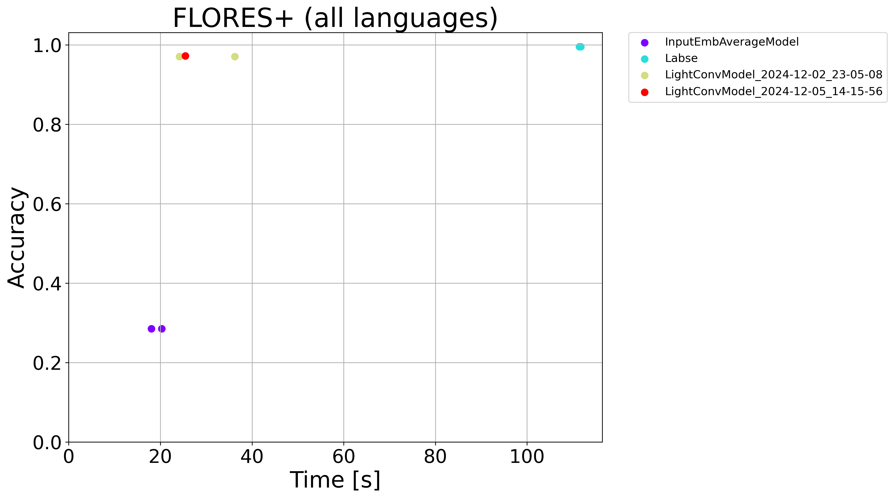
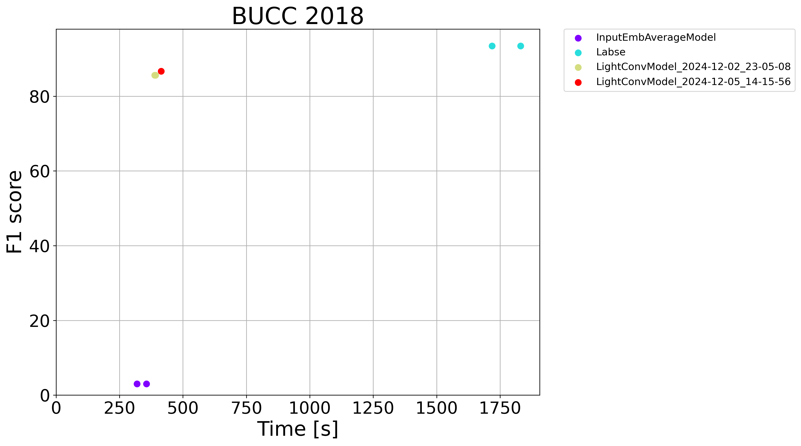
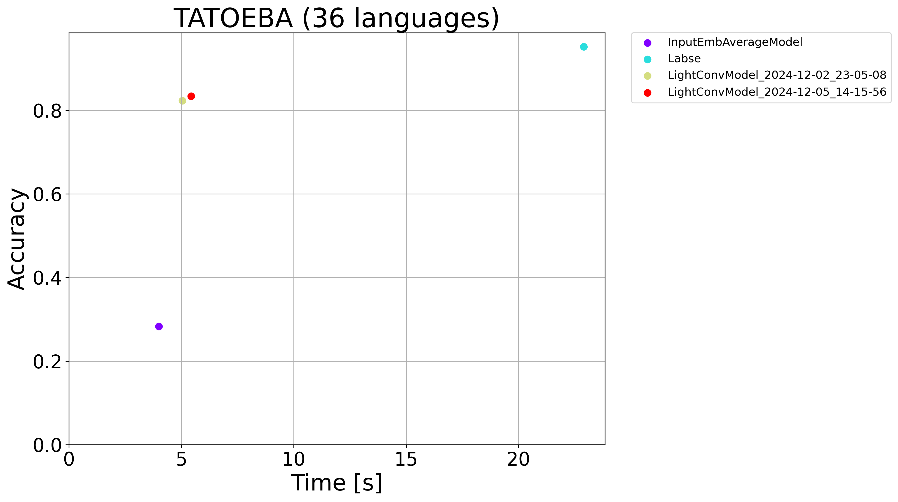

## Efficient Sentence Embeddings

Multilingual sentence embeddings map sentences from different languages into a shared vector space so that sentences with the same meaning end up close together. They are used for cross-lingual transfer (training a classifier in one language and running it in others) and for mining parallel sentences for machine translation.

The standard approach is to use a large Transformer model such as [LaBSE](https://aclanthology.org/2022.acl-long.62.pdf), which produces high-quality embeddings but is slow and requires a GPU. This project explores how much of that quality can be recovered with a much lighter model trained via **knowledge distillation** — the small model learns to mimic LaBSE's outputs rather than learning from scratch.

The student model replaces Transformer self-attention (O(n²) in sequence length) with **lightweight 1D convolutions** (O(n)), making inference significantly faster. It is evaluated against two baselines:
- **LaBSE** — slow, high-quality (the teacher)
- **Word-embedding average** — fast, low-quality (average of LaBSE's input token embeddings, no learned processing)

## Project

### Approach

The core idea is **knowledge distillation**: instead of training from scratch, the student model is trained to reproduce the output embeddings of LaBSE sentence by sentence (MSE loss). This sidesteps the need for parallel training data and lets the student inherit LaBSE's multilingual alignment for free.

The key architectural bet is replacing Transformer self-attention — which is O(n²) in sequence length — with **lightweight 1D convolutions** (O(n)), based on [Pay Less Attention with Lightweight and Dynamic Convolutions](https://openreview.net/pdf?id=SkVhlh09tX) (Facebook AI Research, 2019). To further cut costs, input token embeddings are reused directly from LaBSE and kept **frozen** throughout training. The sentence embedding is the mean of the last layer's token outputs.

### Architecture

Each encoder layer consists of:
1. **Lightweight convolution** — like a depthwise 1D conv, but the kernel weights are shared across groups of embedding dimensions and normalised with softmax before application
2. **GLU** (Gated Linear Unit) — element-wise gating that acts as the activation function
3. **FFN** — standard two-layer feed-forward block with ReLU

Fixed sinusoidal positional embeddings and layer normalisation are applied throughout, same as in a standard Transformer encoder.

| Hyperparameter | Value |
|---|---|
| Embedding dimension | 768 |
| FFN hidden size | 2048 |
| Conv groups | 8 |
| Kernel size | 31 |
| Optimizer | Adam |
| Batch size | 128 |
| Learning rate | 0.0005 |

### Training

Training data comes from [news-crawl](https://data.statmt.org/news-crawl/) — monolingual news text collected from the web. I used up to 500 000 sentences from each of 53 languages (three languages had fewer available). Before training, all sentences were tokenized with LaBSE's tokenizer and saved as integer token sequences to avoid repeating that work during training. LaBSE embeddings for the training sentences were also pre-computed and saved.

The model was trained for **20 000 steps** (10% of the full dataset — the full run would have taken three days; this way it took a few hours) on the AIC GPU cluster at [ÚFAL MFF UK](https://ufal.mff.cuni.cz/), using NVIDIA GTX 1080 Ti, RTX 2080 Ti, and RTX 3090 cards.

The loss curve dropped steeply at the start and then flattened out, suggesting more training could still help slightly.

### Results

The model is **2–3× slower than word-embedding averaging** but **significantly faster than LaBSE**, and it closes most of the quality gap.

**FLORES+** — nearest-neighbour sentence retrieval across 1 012 sentences in 103 languages (only 53 were in the training set):

| Model | Avg. accuracy |
|---|---|
| LaBSE | ~100% |
| **This model** | **~97%** |
| Word-embedding average | ~29% |

The model generalises well beyond the languages it was trained on, which suggests the frozen LaBSE token embeddings carry enough cross-lingual signal even without fine-tuning.

**BUCC 2018** — parallel sentence mining (F1) on four language pairs:

| Language pair | This model | LaBSE | Word-emb avg |
|---|---|---|---|
| de-en | ~89% | ~97% | ~3% |
| fr-en | ~86% | ~96% | ~3% |
| ru-en | ~87% | ~96% | ~3% |
| zh-en | ~84% | ~96% | ~3% |
| avg.  | ~86% | ~96% | ~3% |

Word-embedding averaging completely fails at this task. Unlike FLORES+ (which is a closed 1-to-1 retrieval over 1 012 sentences), BUCC requires mining true parallel pairs from large non-parallel corpora — a much harder nearest-neighbour problem where embedding quality matters a lot more.

**Tatoeba** — for each source sentence, the nearest neighbour in the target language is retrieved (cosine similarity via k-NN with k=1). Accuracy is the fraction of sentences where the retrieved sentence is the correct translation (i.e. at the same index). Source and target sets are the same size N, so random chance is 1/N.

| Model | Avg. accuracy |
|---|---|
| LaBSE | ~96% |
| **This model** | **~82%** |
| Word-emb avg | ~29% |







## Set up the enviroment
Install the following dependencies. Faiss library can be only installed from conda-forge. Fairseq library is installed from github, because there is an error in the official version of fairseq in pip.
```bash
conda create -n ESE python=3.12.5
conda activate ESE
pip install transformers==4.44.2 sentence-transformers==3.1.0
conda install -c pytorch -c nvidia faiss-gpu=1.8.0
pip install git+https://github.com/One-sixth/fairseq.git
```
Also you need to set PYTHONPATH to include path to this folder.
```bash
export PYTHONPATH=$PYTHONPATH:<path_to_this_folder>
```

## Usage

### Download the data

Download the training data:
```bash
python download_data/download.py --path <path_to_data_folder>
python download_data/save_labse_embs.py --path <path_to_data_folder>
python download_data/save_tokens.py --path <path_to_data_folder>
```

Save the labse embedding matrix:
```bash
python download_data/save_labse_emb_matrix.py --path <path_to_file_with_labse_emb_matrix>
```

Download the test data from https://github.com/openlanguagedata/flores and https://comparable.limsi.fr/bucc2018/bucc2018-task.html

The folder structure of BUCC2018 data should be:
```
<path_to_BUCC_data>/de-en/
<path_to_BUCC_data>/de-en/de-en.training.en
<path_to_BUCC_data>/de-en/de-en.training.de
<path_to_BUCC_data>/de-en/de-en.training.gold
<path_to_BUCC_data>/fr-en/
<path_to_BUCC_data>/fr-en/fr-en.training.en
<path_to_BUCC_data>/fr-en/fr-en.training.fr
<path_to_BUCC_data>/fr-en/fr-en.test.gold
<path_to_BUCC_data>/zh-en/
...
<path_to_BUCC_data>/ru-en/
...
```
FLORES+ data should be saved in the following folder structure:
```
<path_to_FLORES_data>/devtest/
<path_to_FLORES_data>/devtest/devtest.eng_Latn
<path_to_FLORES_data>/devtest/devtest.ces_Latn
<path_to_FLORES_data>/devtest/devtest.deu_Latn
<path_to_FLORES_data>/devtest/devtest.fin_Latn
<path_to_FLORES_data>/devtest/devtest.fra_Latn
<path_to_FLORES_data>/devtest/devtest.hrv_Latn
<path_to_FLORES_data>/devtest/devtest.ita_Latn
...
```

### Train the model

```bash
python architectures/init_and_train_model.py --data_path <path_to_data_folder> --save_path <path_to_save_folder>  --emb_path <path_to_file_with_labse_emb_matrix>
```
Training data should be saved in `<path_to_data_folder>`.

See tensorboard logs:
```bash
tensorboard --logdir <path_to_save_folder>/tb
```
The weights of the model after each epoch will be saved in `<path_to_save_folder>/save/model-<epoch>.pt`.

### Evaluate the model
Evaluate the model on BUCC2018 and FLORES+ datasets. The results will be saved in `<path_to_eval_folder>`.
```bash
python evaluation/evaluate.py --model light_convolution --model_path <path_to_model_weights> --BUCC_folder <path_to_BUCC_data> --FLORES_folder <path_to_FLORES_data> --eval_folder <path_to_eval_folder>
```
Now evaluate labse model as baseline:
```bash
python evaluation/evaluate.py --model labse --BUCC_folder <path_to_BUCC_data> --FLORES_folder <path_to_FLORES_data> --eval_folder <path_to_eval_folder>
```
And now evaluate the other baseline, which averages word embeddings:
```bash
python evaluation/evaluate.py --model word_emb --BUCC_folder <path_to_BUCC_data> --FLORES_folder <path_to_FLORES_data> --eval_folder <path_to_eval_folder>
```

### Inference
```bash
python evaluation/predict.py --model_path <path_to_model_weights> --input_file <path_to_input_file> --output_file <path_to_output_file> --emb_path <path_to_file_with_word_emb_matrix>
```